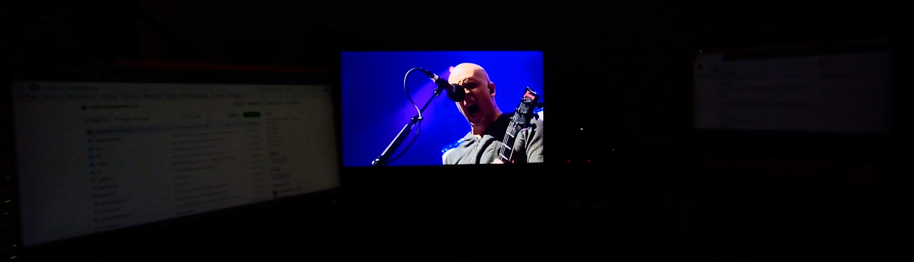
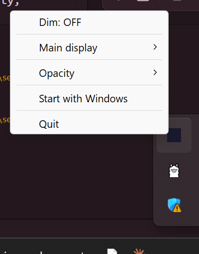

# 🎬 Seenema

A small **dimmer tray utility for Windows** for **multi-screen setups**.
By Marco Pragliola <marcopragliola@gmail.com>

## What it does

When launched, **Seenema** sits in your system tray, and when active it will dim
all the monitors but one: useful when you need to watch a course, a movie or any other
activity requiring visual focus, reducing the distraction from other screens.

## Features

* tiny executable, no install
* unobtrusive, sits in the **system tray**
* you can set an **opacity** for the dark overlay if you still want to keep an eye
  on what happens on the other displays
* the dark overlay is **click-through**: paired with opacity, it will not block you
  from interacting with the dimmed displays

  

## Usage

### Build from source

You can build the executable for Windows by launching `build.bat`.

### Download

You can also download the pre-built .exe from the [Releases](https://github.com/mpragliola/seenema/releases) page of this repository.
